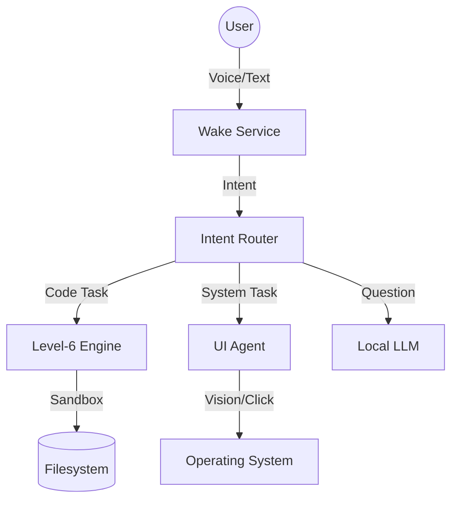

# 🤖 J.A.R.V.I.S — Just A Rather Very Intelligent System

[](https://www.gnu.org/licenses/gpl-3.0)
[](#-why-jarvis)
[](https://www.python.org/downloads/)

**J.A.R.V.I.S** is a cutting-edge, local-first autonomous assistant designed to bring the power of an Iron Man-like AI to your desktop. Unlike cloud-dependent assistants, J.A.R.V.I.S runs entirely on your hardware, prioritizing privacy, speed, and deep system integration.

---

## 🌟 Why J.A.R.V.I.S?

Most AI assistants are just chatbots. **J.A.R.V.I.S is an operator.**

- **🔒 Privacy First:** Your data never leaves your machine. Local-first architecture ensures your interactions stay private.
- **🛠️ Level-6 Autonomous Coding:** Beyond simple code snippets. J.A.R.V.I.S can plan refactors, generate tests, run them in a sandbox, and auto-debug failures.
- **👁️ UI Vision & Automation:** J.A.R.V.I.S sees what you see. It uses OCR and accessibility trees to automate *any* application—from WhatsApp to File Explorer.
- **🎙️ Persistent Wake Service:** A low-CPU standby mode that listens for its name and engages in natural, multi-turn conversations.

---

## 🚀 Key Features

### 🧠 The Brain (AgentCore)
- **Autonomous Planning:** Complex intent routing and task decomposition.
- **Self-Reflection:** Evaluates its own actions to improve accuracy.
- **Memory Store:** Remembers context across sessions for a truly personal experience.

### 💻 Level-6 Self-Debugging Engine
The pinnacle of autonomous engineering:
1. **Plan:** Architect a solution for your request.
2. **Test:** Generate unit tests *before* writing code.
3. **Execute:** Run code in an isolated sandbox.
4. **Debug:** If tests fail, J.A.R.V.I.S analyzes the stack trace and fixes itself.

### 🖱️ UI Agent (Vision + Action)
- **Multi-Mode Execution:** Tries native API adapters first, then falls back to UI automation (PyAutoGUI/OCR) if needed.
- **Safety Gated:** Every action is checked against a strict safety policy.
- **Vision Aware:** Real-time screen capture and element detection.

---

## 🛠️ Installation & Setup

### Prerequisites
- Python 3.8+

### Quick Start
1. **Clone and Install:**
   ```bash
   git clone https://github.com/yourusername/jarvis.git
   cd jarvis
   pip install -r requirements.txt
   pip install -e .
   ```
   The second command registers a real `jarvis` command on your PATH
   (an editable install, so it stays pointed at this checkout -- no
   separate copy is made). After this, `jarvis` works from any
   directory, any terminal, the same way `git` or `claude` do.
2. **Launch J.A.R.V.I.S:**
   - **Interactive Mode:** `jarvis`
   - **Conversational Service:** `jarvis --convo`
   - **Background Daemon:** `python -m daemon.cli start`
   - **Re-run the first-time setup walkthrough:** `jarvis --convo --setup`

   Still callable the old way too (`python jarvis.py ...` from inside
   the project directory) if you'd rather not install the PATH command.

### Configuration
- **Wake Word:** Default is `JARVIS`. Configure via `JARVIS_WAKE_WORD` environment variable.
- **Safety:** Set `ALLOW_DESTRUCTIVE=true` to enable high-risk commands (Default: `false`).

### Automation Daemon CLI
- `python -m daemon.cli status` — Check service status
- `python -m daemon.cli dry-run` — One-shot safety check
- `python -m daemon.cli stop` — Stop the background service

---

## 🏗️ Architecture



### STT Integration
Use `stt_integration.py` to subscribe to existing STT transcript events:

```python
from daemon import DaemonConfig, JarvisDaemon
from stt_integration import wire_to_existing_stt

daemon = JarvisDaemon(DaemonConfig.from_env(dry_run=True))
daemon.start()
wire_to_existing_stt(existing_stt_source, daemon)
```

---

## 🛡️ Safety & Auditing

- **Dry-Run Mode:** Actions are logged but not executed. Enable via CLI or environment.
- **Structured Logs:** Action history is written to `logs/jarvis_actions.log` (JSONL).
- **Automation Verifier:**
  ```bash
  python tools/automation_verifier.py --output logs/audit.json
  ```

---

## 🚀 Deployment & Maintenance

### Startup Installation
- **Linux:** `tools/installer.sh` & systemd service in `tools/systemd/`
- **Windows:** `powershell -ExecutionPolicy Bypass -File tools/installer.ps1`
- **macOS:** LaunchAgent example in `tools/macos/`

### Rollback Steps
If you need to revert changes:
1. `python -m daemon.cli stop`
2. Run rollback script:
   - Linux: `bash tools/rollback.sh`
   - Windows: `powershell -ExecutionPolicy Bypass -File tools/rollback.ps1`

---

## 🧪 Testing
- **Baseline:** `PYTHONPATH=. pytest -q tests`
- **Automation Upgrade:** `PYTHONPATH=. pytest -q tests/automation_upgrade`

---

## 📄 License
Distributed under the GNU General Public License v3. See `LICENSE` for more information.

---
*Built with ❤️ for the open-source community.*
